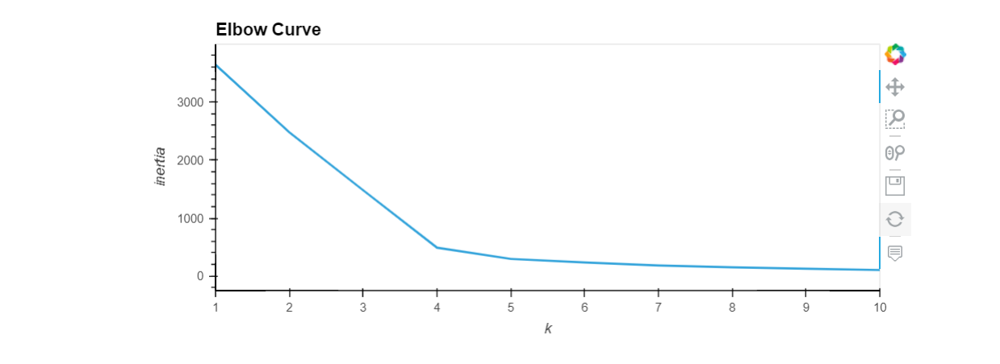
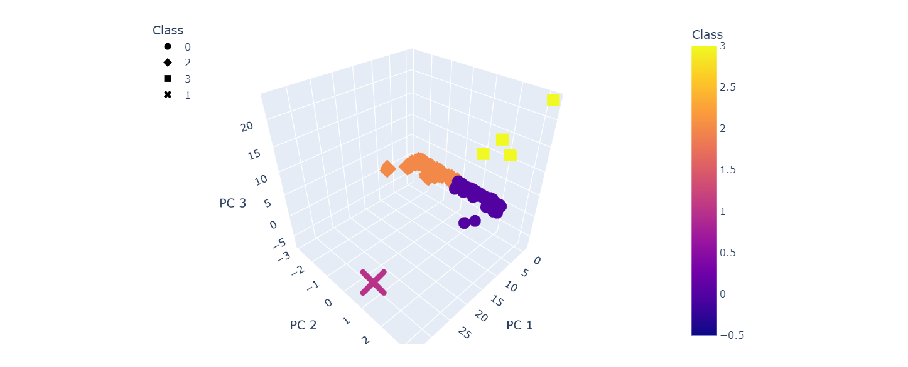
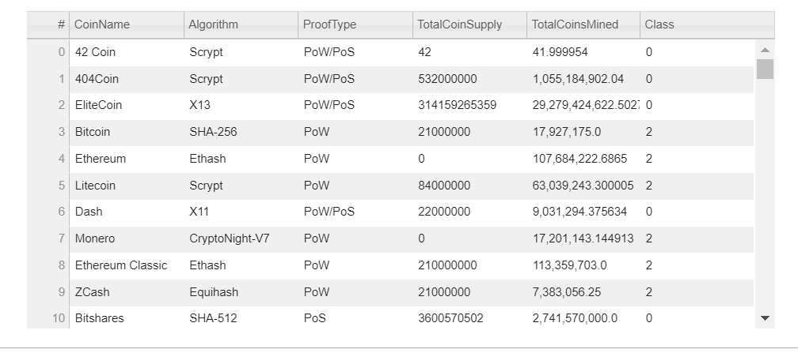
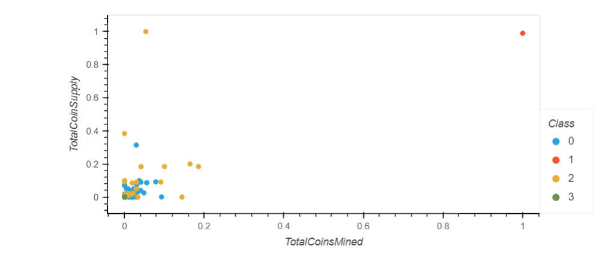

# Cryptocurrencies
Unsupervised Machine Learning

## Overview & Purpose

The project has been undertaken on behalf of a fictitious investment bank named "Accountability Accounting" that is interested in offering a cryptocurrency investment portfolio for its customers. The purpose of this project is to use unsupervised machine learning in order to create a report that includes what cryptocurrencies are on the trading market and how they could be grouped to create a classification system for this new investment.

The final analysis includes the following aspects:

- Preprocessing the data for PCA
- Reducing Data Dimensions using PCA
- Clustering cryptocurrencies using K-Means
- Visualizing cryptocurrencies results

## Resources

- Data Source: crypto_data.csv
- Software: Python 3.7, Jupyter Notebook
- Topic: Unsupervised Machine Learning

## Results

The original dataframe contains 1,252 rows. The dataframe has been preprocessed by dropping rows with one or more null values and by filtering on the basis of currently traded cryptocurrencies and coins mined. Following the preprocessing and cleaning, there are in total 532 tradable cryptocurrencies.

In the next step, Principal Component Analysis (PCA) has been applied to reduce the number of dimensions by transforming a large set of variables into a smaller one that combines most of the information in the original large set. The data has been standardized using the **StandardScaler** library and then PCA has been applied which reduced the dimensions to three principal components.

Next, an elbow curve has been generated using the **K-Means algorithm** and **hvplot** to find the best value for K. Subsequently, K-Means algorithm has been used to predict the K clusters for the cryptocurrencies data.

From the elbow curve, it can be determined that the optimal number of clusters in this case is 4 (k=4). This information has been used to specify the number of clusters when initializing the K-Means model.

In the visualization section, a 3-D graph has been generated using **Plotly Express** to visualize the distinct groups that correspond to the three principal components and the data has also been generated in the form of a table using **hvTable**. The hvTable displays all of the currently tradable cryptocurrencies.

### hvTable

Finally, the "TotalCoinsMined" and the "TotalCoinSupply" columns were scaled again using the **MinMaxScaler** and a scatter plot has been created for the data using **hvplot**.

